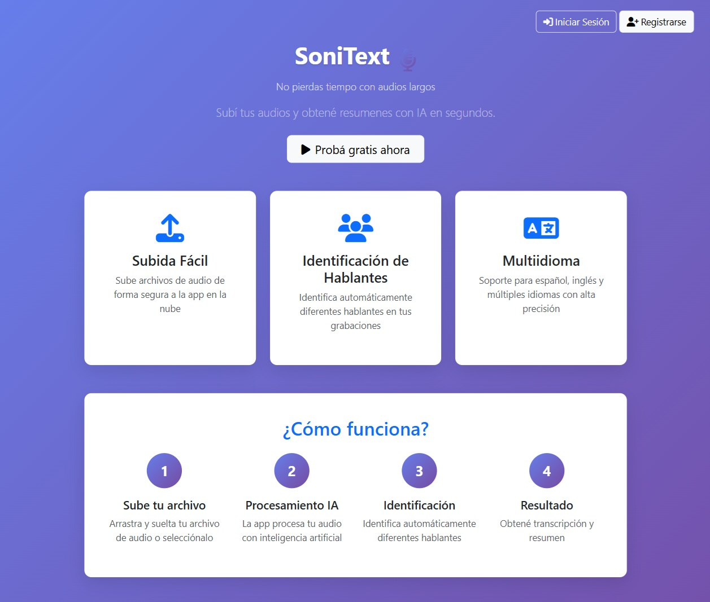
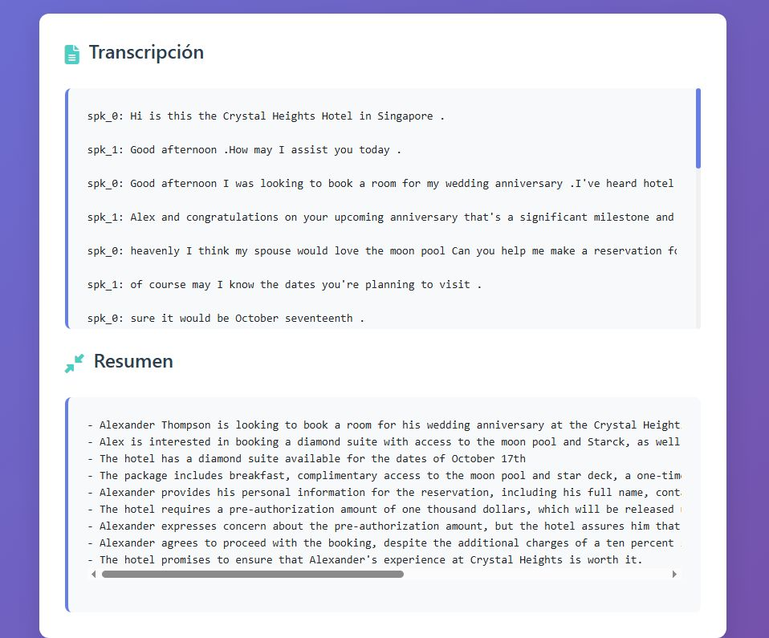

# Transcripción con Resumen / Audio Transcription with Summary

[English](#english) | [Español](#español)

## Español

### ¿Qué hace este proyecto?

Este proyecto es una aplicación web que permite **transcribir archivos de audio automáticamente** y generar resúmenes de las transcripciones. La aplicación utiliza servicios de AWS para procesar los archivos de audio y generar transcripciones con identificación de hablantes.

A diferencia de otros servicios de transcripción y resúmenes, esta aplicación está enfocada en la privacidad de la información, asegurando que el usuario final tenga control sobre los audios que sube a la plataforma, con la garantía de que no van a ser usados por terceros. Además, los archivos que se suben se borran automáticamente en 48hs, el usuario tiene la posibilidad de realizar una descarga local de sus procesamientos y puede realizar un borrado manual completo en cualquier momento.

<p align="center">
  <em>Pantalla principal con el formulario de carga del audio</em>
  
</p>

<p align="center">
  <em>Vista del resumen generado automáticamente</em>
  
</p>

### Características principales:

- **Subida de archivos de audio** a AWS S3
- **Transcripción automática** usando AWS Transcribe
- **Identificación de hablantes** (speaker diarization)
- **Soporte multiidioma** (español, inglés, etc.)
- **Interfaz web moderna** con Bootstrap
- **Formateo de transcripciones**

### Estructura del proyecto

```text
transcripcion-con-resumen-frontend/
├── frontend/                    # Aplicación web frontend
│   ├── pages/                   # Páginas HTML de la aplicación
│   │   ├── app.html             # Interfaz principal (subida de audios)
│   │   ├── callback.html        # Redirección tras autenticación
│   │   ├── logout.html          # Confirmación de cierre de sesión
│   │   ├── privacy.html         # Política de privacidad
│   │   └── userDashboard.html   # Historial y gestión de archivos
│   └── src/                     # Lógica y utilidades
│       ├── audioUtils.js        # Utilidades para medir/procesar audios
│       ├── auth.js              # Configuración de autenticación (Cognito/OIDC)
│       ├── callback.js          # Manejo de la redirección de autenticación
│       ├── config.js            # Variables y configuración global
│       ├── dashboard.js         # Lógica del historial de usuario
│       ├── loginHandler.js      # Disparador de inicio de sesión
│       ├── logoutHandler.js     # Disparador de cierre de sesión
│       ├── logoutPage.js        # Lógica de la pantalla de cierre
│       ├── main.js              # Funcionalidad principal (subida y estado)
│       ├── privacy.js           # Navegación para política de privacidad
│       ├── s3Credentials.js     # Obtención de identidad mediante Identity Pool
│       ├── s3Upload.js          # Lógica para subir archivos a S3
│       ├── statusChecker.js     # Llamadas a la API (estado, descarga, borrado)
│       ├── styles.css           # Estilos de la aplicación
│       └── transcribe.js        # Petición inicial para transcribir audios
├── infra/                       # Infraestructura CDK
│   └── infra/
│       └── infra_stack.py       # Stack de infraestructura AWS
└── README.md                    # Este archivo
```

### Instalación y configuración

#### Prerrequisitos
- Node.js (versión 14 o superior)
- Python 3.8+
- AWS CLI configurado
- Cuenta de AWS

#### 1. Instalar dependencias del frontend

```bash
cd frontend
npm install
```

#### 2. Configurar infraestructura CDK

```bash
# Crear entorno virtual de Python
cd infra
python -m venv .venv

# Activar entorno virtual
# En Windows:
.venv\Scripts\activate
# En macOS/Linux:
source .venv/bin/activate

# Instalar dependencias de CDK
pip install -r requirements.txt

# Instalar AWS CDK (si no está instalado)
npm install -g aws-cdk

# Verificar instalación
cdk --version
```

#### 3. Desplegar infraestructura

```bash
# Desde la carpeta infra/
cdk bootstrap  # Solo la primera vez
cdk deploy
```

Para realizar un despliegue rápido únicamente de los archivos estáticos del frontend (sin alterar la infraestructura), ejecuta desde la carpeta `root`:
```bash
npm run deploy:fast
```

### Uso de la aplicación

1. Abre la aplicación web en tu navegador
2. Selecciona un archivo de audio
3. Elige el idioma (ej: es-ES para español, en-US para inglés)
4. Indica el número de hablantes
5. Haz clic en enviar para iniciar la transcripción

### Tecnologías utilizadas

- **Frontend**: JavaScript vanilla, Bootstrap, AWS SDK
- **Backend**: AWS Lambda, API Gateway
- **Almacenamiento**: AWS S3
- **Transcripción**: AWS Transcribe
- **Infraestructura**: AWS CDK (Python)

---

## English

### What does this project do?

This project is a web application that allows you to **automatically transcribe audio files** and generate summaries of the transcriptions. The application uses AWS services to process audio files and generate transcriptions with speaker identification.

Unlike other transcription and summarization services, this application is highly focused on information privacy, ensuring that the end user maintains full control over the audio files they upload to the platform, with the guarantee that they will not be used by third parties. In addition, uploaded files are automatically deleted after 48 hours, and users have the ability to perform local downloads or manually delete their files completely at any time.

<p align="center">
  <em>Main screen with form to upload audio file</em>
  
</p>

<p align="center">
  <em>Transcription and summary generated by the app</em>
  
</p>

### Main features:

- **Audio file upload** to AWS S3
- **Automatic transcription** using AWS Transcribe
- **Speaker identification** (speaker diarization)
- **Multi-language support** (Spanish, English, etc.)
- **Modern web interface** with Bootstrap
- **Transcription formatting**

### Project structure

```text
transcripcion-con-resumen-frontend/
├── frontend/                    # Frontend web application
│   ├── pages/                   # HTML Pages
│   │   ├── app.html             # Main interface (audio upload)
│   │   ├── callback.html        # Authentication callback
│   │   ├── logout.html          # Logout confirmation
│   │   ├── privacy.html         # Privacy policy
│   │   └── userDashboard.html   # User history and file management
│   └── src/                     # Logic and utilities
│       ├── audioUtils.js        # Audio processing utilities
│       ├── auth.js              # Auth configuration (Cognito/OIDC)
│       ├── callback.js          # Auth redirection handling
│       ├── config.js            # Global configuration
│       ├── dashboard.js         # User dashboard logic
│       ├── loginHandler.js      # Login trigger
│       ├── logoutHandler.js     # Logout trigger
│       ├── logoutPage.js        # Logout screen logic
│       ├── main.js              # Main functionality (upload and status)
│       ├── privacy.js           # Privacy policy navigation
│       ├── s3Credentials.js     # AWS Identity Pool credentials
│       ├── s3Upload.js          # S3 upload logic
│       ├── statusChecker.js     # API calls (status, download, delete)
│       ├── styles.css           # Application styles
│       └── transcribe.js        # Initial transcription API call
├── infra/                       # CDK Infrastructure
│   └── infra/
│       └── infra_stack.py       # AWS infrastructure stack
└── README.md                    # This file
```

### Installation and setup

#### Prerequisites
- Node.js (version 14 or higher)
- Python 3.8+
- AWS CLI configured
- AWS Account

#### 1. Install frontend dependencies

```bash
cd frontend
npm install
```

#### 2. Set up CDK infrastructure

```bash
# Create Python virtual environment
cd infra
python -m venv .venv

# Activate virtual environment
# On Windows:
.venv\Scripts\activate
# On macOS/Linux:
source .venv/bin/activate

# Install CDK dependencies
pip install -r requirements.txt

# Install AWS CDK (if not installed)
npm install -g aws-cdk

# Verify installation
cdk --version
```

#### 3. Deploy infrastructure

```bash
# From the infra/ folder
cdk bootstrap  # Only the first time
cdk deploy
```

For a quick deployment of only the frontend static files (without altering infrastructure), run from the `root` folder:
```bash
npm run deploy:fast
```

### How to use the application

1. Open the web application in your browser
2. Select an audio file
3. Choose the language (e.g., es-ES for Spanish, en-US for English)
4. Specify the number of speakers
5. Click submit to start transcription

### Technologies used

- **Frontend**: Vanilla JavaScript, Bootstrap, AWS SDK
- **Backend**: AWS Lambda, API Gateway
- **Storage**: AWS S3
- **Transcription**: AWS Transcribe
- **Infrastructure**: AWS CDK (Python)

### API Endpoint

The application communicates with the backend through:
- **API URL**: `https://yfoulcwp9a.execute-api.us-east-1.amazonaws.com/prod/transcribir`
- **S3 Bucket**: `transcripcion-con-resumen-backend`
- **Region**: `us-east-1`

### Configuration

Make sure to configure the following before deployment:
- AWS credentials and region
- S3 bucket CORS policy for frontend uploads
- Cognito authentication setup (referenced in `cognitoAuth.js`)